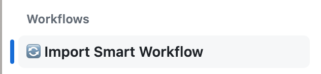

  <a href="https://github.com/apps/pr-pilot-ai/installations/new"><b>Install</b></a> |
  <a href="https://docs.pr-pilot.ai">Documentation</a> | 
  <a href="https://www.pr-pilot.ai/blog">Blog</a> | 
  <a href="https://www.pr-pilot.ai">Website</a>

# Smart Project Starter

This project comes with **[Smart Workflows](https://github.com/PR-Pilot-AI/smart-workflows/tree/main)** that use an AI agent
to automate Github projects in powerful ways.

* **Plug-and-play** - Install new automations and tools with the click of a button
* **Fully Customizable** using natural language instructions.
* **LLM Best Practices** baked in, so you can focus on what matters

## Using the Template

1. Create a **[new Github project using this template](https://github.com/new?template_name=smart-project-starter&template_owner=PR-Pilot-AI)**
2. **[Install the AI agent](https://github.com/apps/pr-pilot-ai/installations/new)** on your repository

## Importing Tools and Automations

Open the `Actions` tab 

and select **[🔄 Import Smart Workflow](tools/import-workflow)**.

Now, run the workflow with the ID of the **[Smart Workflow](https://github.com/PR-Pilot-AI/smart-workflows/tree/main)** you'd like to import:

A new PR will be created that contains your imported workflow and ideas for how to customize for your project's needs.
